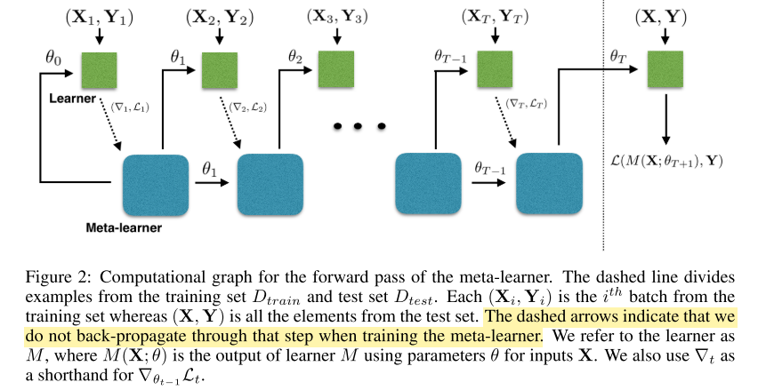
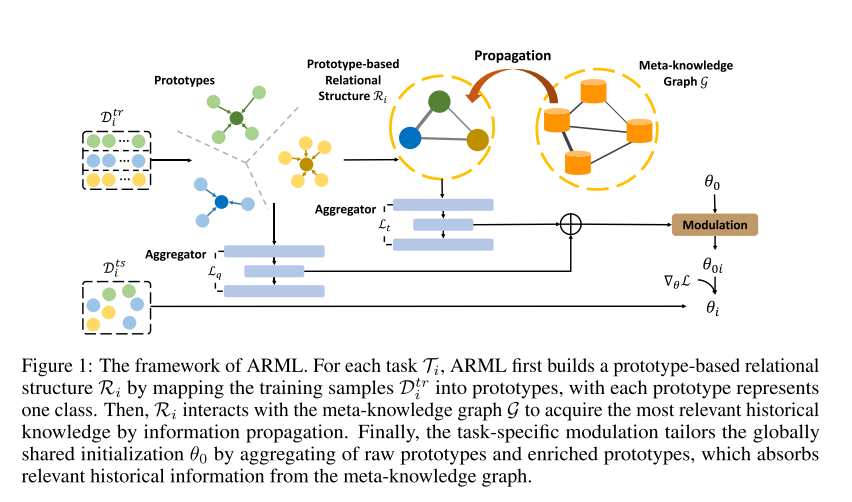
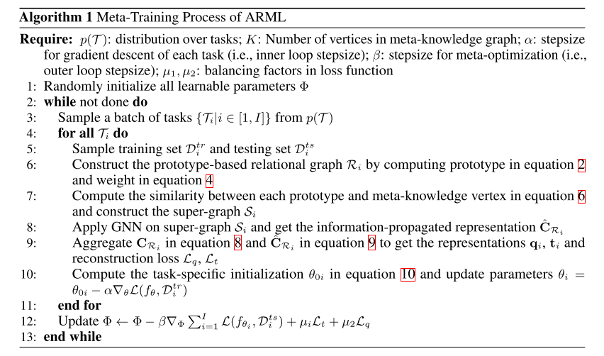

# computer_vision_and_graphics

In this section we discuss the ways in which meta-learning has been exploited – in terms of application domains such as computer vision and reinforcement learning and cross-cutting problems such as architecture search, hyper- parameter optimization, Bayesian and unsupervised meta- learning.

**5.1 Computer Vision and Graphics Computer vision** is one of the major consumer domains of meta-learning techniques. This is particularly driven by the impact of meta-learning on few-shot learning which holds promise to deal with the challenge posed by the long-tail of concepts to recognise in vision.

**5.1.1 Few-Shot Learning Methods Few-shot learning (FSL)** is extremely challenging, especially for large neural network models [1], [15], where data vol- ume is often the dominant factor in performance [188], and training large models with small datasets leads to over- fitting or even non-convergence. Meta-learning-based few- shot learning methods train algorithms that enable powerful deep networks to successfully learn on small datasets. There are numerous vision problems where meta-learning helps

in the few-shot setting, and we provide a non-exhaustive summary as follows. 

**Classification **The most common application of meta- learning thus far is few-shot multi-class classification in image recognition, where the inner and outer loss functions are typically the cross entropy over training and validation data respectively [19], [20], [41], [73], [75], [76], [86], [88], [97], [98], [101], [161], [189]–[193]. Optimizer-centric [19], black-box [40], [79] and metric learning [86]–[88] models have all been considered. Relevant benchmarks are covered in Section 5.1.2. This line of work has led to a steady improvement in performance compared to early methods [19], [85], [86]. However, performance is still far behind that of fully super- vised methods, so there is more work to be done. Current research issues include few-shot models with better cross- domain generalization [173], recognition within the joint label space defined by meta-train and meta-test classes [80], and incremental addition of new few-shot classes [128], [165].

**Object Detection** Building on the rapid progress in few- shot classification, recent work has also generalized to few- shot object detection [165], [194], often using feed-forward hypernetwork-based approaches to embed support set im- ages and synthesize final layer classification weights in the base model.

**Landmark Prediction** The goal of landmark estimation is to find the location of skeleton key points within an image, such as such as joints in human or robot images. This is typically formulated as an image-conditional regression problem. For example, a MAML-based model was shown to work for human pose estimation [195], modular-meta- learning was successfully applied to robotics [130], while a hypernetwork-based model was applied to few-shot clothes fitting for novel fashion items [165].

**Object Segmentation** Few-shot object segmentation is important due to the cost of obtaining pixel-wise labeled images in this domain. Meta-learning methods based on hypernetworks have been shown to work in the one-shot regime [196], and performance was later improved by adapting prototypical networks [197]. Other models tackle cases where segmentation has low density [198].

**Image Generation** In [199] an amortized probabilistic meta-learner is used to generate multiple views of an object from just a single image, and talking faces are generated from little data by learning the initialization of an adversar- ial model for quick adaptation [200].

**Video Synthesis** In [201], the authors propose meta-learning a weight generator that takes as input a few frames and generates a network that can achieve strong results in video synthesis for the given task.

**Density Estimation** Since autoregressive models typically require large depths to capture the distribution of the data, the few-shot regime lands itself to overfitting and is partic- ularly challenging. Meta-learning coupled with an attention mechanism has shown to enable PixelCNNs to shine in such a regime [202].

**5.1.2 Few-Shot Learning Benchmarks** Progress in AI and machine learning is often measured by, and spurred by, well designed benchmarks [203]. In machine learning, a benchmark is composed by a dataset and a task that a model should perform well on, while generalising from training to testing instances from within that dataset. In meta-learning, benchmark design is more complex, since we are often dealing with a learner that should be (meta) trained on a set of tasks, after which it should generalize to learning on previously unseen tasks. Benchmark design is thus more complex due to the need to define families of tasks from which meta-training and meta- testing tasks can be drawn. In this section we will outline the main few-shot benchmarks.

**Benchmarks and Setup** Most FSL studies consider the set-to-set setting, where
a model must learn to do well in a large number of small few-shot learning tasks. Each such task is composed of a small training set (referred to as a support set) consisting of a number of a few labelled examples from a number of classes and a small validation set (referred to as a query set) consisting of previously unseen instances of the same classes contained in the support set. A learner should be able to extract task-specific information from a support set, and then generate a model that can perform well on the query set. Across-task knowledge can be learned by learning the learner that can do this task well. We usually use the notation of N-way K-shot task, to indicate a task with N classes per task, and K samples per class.

There are a number of established FSL datasets that are
used in this setting, such as miniImageNet [41], tieredIm- ageNet [204], SlimageNet [205], CUB-200 [110] and Om- niglot [86]. These benchmarks re-purpose prior datasets with rather large numbers of classes by breaking them into many smaller (lower ‘way’) recognition problems to define a task distribution for benchmarking meta-training and meta- testing.

**Dataset Diversity, Bias and Generalization** While the above approach is convenient to generate enough tasks for training and evaluation, it suffers from a lack of diversity (narrow p(T)) which makes it hard for performance on these benchmarks to reflect performance on real-world few shot task. For example, switching between different kinds of animals in miniImageNet or birds in CUB is a rather weak test of transferability. Ideally we would like to span more diverse categories and types of images (satellite, med- ical, agricultural, underwater, etc); and even be robust to domain-shifts between meta-train and meta-test tasks. There is much work still to be done here as, even
in the many-shot setting, fitting a deep model to a very wide distribution of data is itself non-trivial [206], as is generalising to out-of-sample data [44], [92]. In particular, the performance of meta-learners has been shown to drop drastically when introducing a domain shift between the source and target task distributions [110]. This motivates the recent Meta-Dataset [207] and CVPR cross-domain few- shot challenge [208]. Meta-Dataset aggregates a number of individual recognition benchmarks to provide a wider distribution of tasks p(T) to evaluate the ability to fit a wide task distribution and generalize across domain-shift.
Meanwhile, [208] challenges methods to generalize from the everyday images of ImageNet to medical, satellite and agri- cultural images. Recent work has begun to try and address these issues by meta-training for domain-shift robustness as well as sample efficiency [173]. Generalization issues also arise in applying models to data from under-represented countries [209]. Another recent dataset that could facilitate research in few-shot learner generalization is [210], which offers samples across environments from simulation, to high definition simulation and real-world.

**Real-World Few-Shot Recognition** The most common few-shot problem setting is N-way recognition among the classes in the support set [19], [20]. However, this may not be representative of practical application requirements where recognition among both the source and target is of interest at testing-time. This generalized few-shot setting is considered in an increasing number of studies [128], [165], [211]. In a generalized few-shot setting, other goals include efficient incremental enrolment of novel few-shot classes without forgetting the base classes or re-accessing the source data [128], [165]. Other real-world challenges include scaling up few-shot learning beyond the widely studied N = 1 . . . 20- way recognition setting, at which point the popular and effective metric learner method family [20], [87] begin to struggle.

**Few-Shot Object Detection** The few studies [165] on few- shot detection have thus far re-purposed standard detection datasets such as COCO and Pascal VOC. However these only offer a few classes for meta-training/testing compared to classification benchmarks, and so more benchmarks are needed

**Regression Benchmarks** Unfortunately there has been less work on establishing common benchmarks for few-shot regression than for classification. Toy problems such as 1d sinusoidal regressions have been proposed in [19], [212]. Im- age completion by regressing from pixel coordinate to RGB value have been considered [166], some work regresses to interest points in human pose and fashion [165], while [213] considers the task of face pose regression, with additional occlusion to introduce ambiguity. Overall, these tasks are all scattered and the meta-learning community has yet to reach consensus on regression benchmarks.

**Non meta-learning few-shot methods** Recently, a num- ber of non meta-learning methods have obtained competi- tive performance on few-shot benchmarks, questioning the need for learning to learn in this setting. It was shown in [110] that training on all the base tasks at once and finetun- ing on the target tasks is a stronger baseline than initially reported, mainly because augmentation was unfairly omit- ted. Furthermore, using a deeper backbone may shrink the performance gap between common meta-learning methods, and the baseline can outperform these methods for larger domain shifts between source and target task distributions [207] – although more recent meta-learning methods ob- tained good performance in this setting [173]. On a similar theme, [214] show that simple feature transformations like L2-normalization can make a nearest neighbour classifier competitive without meta-learning. Thus the debate here is ongoing, but overall carefully implemented baselines and more diverse datasets are important, as well as maintaining
fair and consistent best practice for all methods

<!-- REFERENCE -->

[199] Meta-Learning Probabilistic Inference For Prediction

 
<!-- (meta_learning_probabilistic_inference_for_prediction.md) -->

# meta_learning_probabilistic_inference_for_prediction.md

<!-- REFERENCE -->

[Meta-Learning Probabilistic Inference For Prediction](../papers/meta_learning_probabilistic_inference_for_prediction.md)

[189] Fast Context Adaptation Via Meta-learning

 
<!-- (fast_context_adaptation_via_meta_learning.md) -->

# fast_context_adaptation_via_meta_learning.md

<!-- REFERENCE -->

[Fast Context Adaptation Via Meta-learning](../papers/fast_context_adaptation_via_meta_learning.md)

[201] Few-shot Video-to-video Synthesis

 
<!-- (few_shot_video_to_video_synthesis.md) -->

# few_shot_video_to_video_synthesis.md

<!-- REFERENCE -->

[Few-shot Video-to-video Synthesis](../papers/few_shot_video_to_video_synthesis.md)

[40] A Simple Neural Attentive Meta-learner

 
<!-- (a_simple_neural_attentive_meta_learner.md) -->

# a_simple_neural_attentive_meta_learner.md
## What?
- A meta-learner architecture that use a novel combination of temporal convolutions and soft attention; the former to aggregate information from past experience and the latter to pinpoint specific pieces of information.
## Why?
- Handle the problems: architectures specialized to a particular application, or hard-coding algorithmic components that constrain how the meta-learner solves the task
## How?

## Results? (What did they find?)
- Effective black-box using self attention 
- Note:
    - trained the SNAIL on episodes where the number of shots K was chosen uniformly at random from 1 to 5 (note that this is unlike prior works, who train separate models for each shot)
    - complicated architecture, not sure that can compare with original MAML
## Ideas to improve?

<!-- REFERENCE -->

[A Simple Neural Attentive Meta-learner](../papers/a_simple_neural_attentive_meta_learner.md)

[128] Incremental Few-shot Learning With Attention Attractor Networks

 
<!-- (incremental_few_shot_learning_with_attention_attractor_networks.md) -->

# incremental_few_shot_learning_with_attention_attractor_networks.md

<!-- REFERENCE -->

[Incremental Few-shot Learning With Attention Attractor Networks](../papers/incremental_few_shot_learning_with_attention_attractor_networks.md)

[76] How To Train Your MAML

 
<!-- (how_to_train_your_maml.md) -->

# how_to_train_your_maml.md
## What?
- Research the practical training techniques help training MAML more effective
## Why?
Disadvantage of original MAML:
- Training Instability: lack of any skip connections
- Second Order Derivative cost
- Absence of Batch Normalization Statistic Accumulation
- Shared (across step) Batch Normalization Bias
- Shared Inner Loop (across step and across parameter) Learning Rate
- Fixed Outer Loop Learning Rate
## How?
Handle these above problem:
- Gradient Instability → Multi-Step Loss Optimization (MSL): propose minimizing the target set loss computed by the base-network after every step towards a support set task,
the loss minimized is a weighted sum of the target set losses after every support set loss update, employ an annealed weighting for the per step losses.

- Second Order Derivative Cost → Derivative-Order Annealing (DA): propose to anneal the derivative-order as training progresses. More specifically, we propose to use first-order gradients for the first 50 epochs of the training phase, and to then switch to second-order gradients for the remainder of the training phase
Using first-order before starting to use second-order derivatives can be used as a strong pretraining method that learns parameters less likely to produce gradient explosion/diminishment issues.
- Absence of Batch Normalization Statistic Accumulation → Per-Step Batch Normalization Running Statistics (BNRS): instantiate N (where N is the total number of inner-loop update steps) sets of running mean and running standard deviation for each batch normalization layer in the network and update the running statistics respectively with the steps being taken during the optimization. The per-step batch normalization methodology should speed up optimization of MAML whilst potentially improving generalization performance

- Shared (across step) Batch Normalization Bias → Per-Step Batch Normalization Weights and Biases (BNWB): batch normalization will learn biases specific to the feature distributions seen at each set, which should increase convergence speed, stability and generalization performance.

- Shared Inner Loop Learning Rate (across step and across parameter) → Learning Per-Layer Per-Step Learning Rates and Gradient Directions (LSLR): we propose, learning a learning rate and direction for each layer in the network as well as learning different learning rates for each adaptation of the base-network as it takes steps

- Fixed Outer Loop Learning Rate → Cosine Annealing of Meta-Optimizer Learning Rate (CA): we propose applying the cosine annealing scheduling on the meta-model’s optimizer (i.e. the meta-optimizer)

## Results? (What did they find?)
- State of the art results, each of above techniques do improve the results
- Use validation set to get better results: ensemble of the top 3 performing per-epoch-models on the validation set were applied on the test set
## Ideas to improve?
Apply these technique when train modifications of MAML

<!-- REFERENCE -->

[How To Train Your MAML](../papers/how_to_train_your_maml.md)

[196] One-Shot Learning For Semantic Segmentation

 
<!-- (one_shot_learning_for_semantic_segmentation.md) -->

# one_shot_learning_for_semantic_segmentation.md

<!-- REFERENCE -->

[One-Shot Learning For Semantic Segmentation](../papers/one_shot_learning_for_semantic_segmentation.md)

[20] Prototypical Networks For Few Shot Learning

 
<!-- (prototypical_networks_for_few_shot_learning.md) -->

# prototypical_networks_for_few_shot_learning.md

<!-- REFERENCE -->

[Prototypical Networks For Few Shot Learning](../papers/prototypical_networks_for_few_shot_learning.md)

[85] Siamese Neural Networks For One-shot Image Recognition

 
<!-- (siamese_neural_networks_for_one_shot_image_recognition.md) -->

# siamese_neural_networks_for_one_shot_image_recognition.md

<!-- REFERENCE -->

[Siamese Neural Networks For One-shot Image Recognition](../papers/siamese_neural_networks_for_one_shot_image_recognition.md)

[194] Few-shot Object Detection Via Feature Reweighting

 
<!-- (few_shot_object_detection_via_feature_reweighting.md) -->

# few_shot_object_detection_via_feature_reweighting.md

<!-- REFERENCE -->

[Few-shot Object Detection Via Feature Reweighting](../papers/few_shot_object_detection_via_feature_reweighting.md)

[97] Meta-Learning With Latent Embedding Optimization

 
<!-- (meta_learning_with_latent_embedding_optimization.md) -->

# meta_learning_with_latent_embedding_optimization.md

<!-- REFERENCE -->

[Meta-Learning With Latent Embedding Optimization](../papers/meta_learning_with_latent_embedding_optimization.md)

[1] Deep Residual Learning For Image Recognition

 
<!-- (deep_residual_learning_for_image_recognition.md) -->

# deep_residual_learning_for_image_recognition.md

<!-- REFERENCE -->

[Deep Residual Learning For Image Recognition](../papers/deep_residual_learning_for_image_recognition.md)

[206] Learning Multiple Visual Domains With Residual Adapters

 
<!-- (learning_multiple_visual_domains_with_residual_adapters.md) -->

# learning_multiple_visual_domains_with_residual_adapters.md

<!-- REFERENCE -->

[Learning Multiple Visual Domains With Residual Adapters](../papers/learning_multiple_visual_domains_with_residual_adapters.md)

[88] Few-Shot Learning With Graph Neural Networks

 
<!-- (few_shot_learning_with_graph_neural_networks.md) -->

# few_shot_learning_with_graph_neural_networks.md

<!-- REFERENCE -->

[Few-Shot Learning With Graph Neural Networks](../papers/few_shot_learning_with_graph_neural_networks.md)

[197] Few-Shot Semantic Segmentation With Prototype Learning

 
<!-- (few_shot_semantic_segmentation_with_prototype_learning.md) -->

# few_shot_semantic_segmentation_with_prototype_learning.md

<!-- REFERENCE -->

[Few-Shot Semantic Segmentation With Prototype Learning](../papers/few_shot_semantic_segmentation_with_prototype_learning.md)

[87] Learning To Compare: Relation Network For FewShot Learning

 
<!-- (learning_to_compare_relation_network_for_fewshot_learning.md) -->

# learning_to_compare_relation_network_for_fewshot_learning.md

<!-- REFERENCE -->

[Learning To Compare: Relation Network For FewShot Learning](../papers/learning_to_compare_relation_network_for_fewshot_learning.md)

[130] Modular Meta- ´ learning

 
<!-- (modular_meta_learning.md) -->

# modular_meta_learning.md

<!-- REFERENCE -->

[Modular Meta- ´ learning](../papers/modular_meta_learning.md)

[75] Meta-SGD: Learning To Learn Quickly For Few Shot Learning

 
<!-- (meta_sgd_learning_to_learn_quickly_for_few_shot_learning.md) -->

# meta_sgd_learning_to_learn_quickly_for_few_shot_learning.md
## What?
- Propose a methods that can learn to update the MAML more efficient, such as: directions and learning rates
## Why?
- MAML is using the same learning rate for all parameters -> slow convergence, not accurate
## How?
- Using one learning rate for each parameter, these learning rates can be learned by meta-learner.

## Results? (What did they find?)
- Better performance, because of learning learning rate value and direction
## Ideas to improve?
- arbitrary function with learning rate, i.e: 

f is an arbitrary function such as neutral network, it is not mathematically theory, but let's try. 
<!-- REFERENCE -->

[Meta-SGD: Learning To Learn Quickly For Few Shot Learning](../papers/meta_sgd_learning_to_learn_quickly_for_few_shot_learning.md)

[41] Optimization As A Model For FewShot Learning

 
<!-- (optimization_as_a_model_for_fewshot_learning.md) -->

# optimization_as_a_model_for_fewshot_learning.md
## What?
- LSTM based meta-learner model to learn the exact optimization algorithm used to train another learner neural network classifier in the few-shot regime.
## Why?
- Handle the few-shot learning problem, the model can transfer 
## How?
This model based on the LSTM, the model modified the update rule of gradient from: 

to 

if  and 

But we can learn the  and 

and

and also we can learn the initial weights of learner, allows the optimization process more rapid.

## Results? (What did they find?)
- Apply the LSTM to learn the learning updates of the parameters of classifier.
- Can learn the good initialization parameters and update rules.
## Ideas to improve?
- The paper shows that by learning and modify the update rules, we could get better results. Could we use this idea?

<!-- REFERENCE -->

[Optimization As A Model For FewShot Learning](../papers/optimization_as_a_model_for_fewshot_learning.md)

[193] Rapid Learning Or Feature Reuse? Towards Understanding The Effectiveness Of Maml

 
<!-- (rapid_learning_or_feature_reuse?_towards_understanding_the_effectiveness_of_maml.md) -->

# rapid_learning_or_feature_reuse?_towards_understanding_the_effectiveness_of_maml.md

<!-- REFERENCE -->

[Rapid Learning Or Feature Reuse? Towards Understanding The Effectiveness Of Maml](../papers/rapid_learning_or_feature_reuse?_towards_understanding_the_effectiveness_of_maml.md)

[92] MetaReg: Towards Domain Generalization Using Meta-Regularization

 
<!-- (metareg_towards_domain_generalization_using_meta_regularization.md) -->

# metareg_towards_domain_generalization_using_meta_regularization.md

<!-- REFERENCE -->

[MetaReg: Towards Domain Generalization Using Meta-Regularization](../papers/metareg_towards_domain_generalization_using_meta_regularization.md)

[214] SimpleShot: Revisiting Nearest-Neighbor Classification For Few-Shot Learning

 
<!-- (simpleshot_revisiting_nearest_neighbor_classification_for_few_shot_learning.md) -->

# simpleshot_revisiting_nearest_neighbor_classification_for_few_shot_learning.md

<!-- REFERENCE -->

[SimpleShot: Revisiting Nearest-Neighbor Classification For Few-Shot Learning](../papers/simpleshot_revisiting_nearest_neighbor_classification_for_few_shot_learning.md)

[213] Deep Kernel Transfer In Gaussian Processes For Few-shot Learning

 
<!-- (deep_kernel_transfer_in_gaussian_processes_for_few_shot_learning.md) -->

# deep_kernel_transfer_in_gaussian_processes_for_few_shot_learning.md

<!-- REFERENCE -->

[Deep Kernel Transfer In Gaussian Processes For Few-shot Learning](../papers/deep_kernel_transfer_in_gaussian_processes_for_few_shot_learning.md)

[188] Revisiting Unreasonable Effectiveness Of Data In Deep Learning Era

 
<!-- (revisiting_unreasonable_effectiveness_of_data_in_deep_learning_era.md) -->

# revisiting_unreasonable_effectiveness_of_data_in_deep_learning_era.md

<!-- REFERENCE -->

[Revisiting Unreasonable Effectiveness Of Data In Deep Learning Era](../papers/revisiting_unreasonable_effectiveness_of_data_in_deep_learning_era.md)

[195] [195] L.-Y. Gui, Y.-X. Wang, D. Ramanan, and J. Moura, Few-Shot Human Motion Prediction Via Meta-learning. Springer, 201

 
<!-- (few_shot_human_motion_prediction_via_meta_learning.md) -->

# few_shot_human_motion_prediction_via_meta_learning.md

<!-- REFERENCE -->

[[195] L.-Y. Gui, Y.-X. Wang, D. Ramanan, and J. Moura, Few-Shot Human Motion Prediction Via Meta-learning. Springer, 201](../papers/few_shot_human_motion_prediction_via_meta_learning.md)

[15] Imagenet Classification With Deep Convolutional Neural Networks

 
<!-- (imagenet_classification_with_deep_convolutional_neural_networks.md) -->

# imagenet_classification_with_deep_convolutional_neural_networks.md

<!-- REFERENCE -->

[Imagenet Classification With Deep Convolutional Neural Networks](../papers/imagenet_classification_with_deep_convolutional_neural_networks.md)

[204] Meta-Learning For Semi-Supervised Few-Shot Classification

 
<!-- (meta_learning_for_semi_supervised_few_shot_classification.md) -->

# meta_learning_for_semi_supervised_few_shot_classification.md

<!-- REFERENCE -->

[Meta-Learning For Semi-Supervised Few-Shot Classification](../papers/meta_learning_for_semi_supervised_few_shot_classification.md)

[198] Few-Shot Segmentation Propagation With Guided Networks

 
<!-- (few_shot_segmentation_propagation_with_guided_networks.md) -->

# few_shot_segmentation_propagation_with_guided_networks.md

<!-- REFERENCE -->

[Few-Shot Segmentation Propagation With Guided Networks](../papers/few_shot_segmentation_propagation_with_guided_networks.md)

[101] Hierarchically Structured Meta-learning

 
<!-- (hierarchically_structured_meta_learning.md) -->

# hierarchically_structured_meta_learning.md

<!-- REFERENCE -->

[Hierarchically Structured Meta-learning](../papers/hierarchically_structured_meta_learning.md)

[86] Matching Networks For One Shot Learning

 
<!-- (matching_networks_for_one_shot_learning.md) -->

# matching_networks_for_one_shot_learning.md

<!-- REFERENCE -->

[Matching Networks For One Shot Learning](../papers/matching_networks_for_one_shot_learning.md)

[200] FewShot Adversarial Learning Of Realistic Neural Talking Head Models

 
<!-- (fewshot_adversarial_learning_of_realistic_neural_talking_head_models.md) -->

# fewshot_adversarial_learning_of_realistic_neural_talking_head_models.md

<!-- REFERENCE -->

[FewShot Adversarial Learning Of Realistic Neural Talking Head Models](../papers/fewshot_adversarial_learning_of_realistic_neural_talking_head_models.md)

[98] Learning To Learn By SelfCritique

 
<!-- (learning_to_learn_by_selfcritique.md) -->

# learning_to_learn_by_selfcritique.md

<!-- REFERENCE -->

[Learning To Learn By SelfCritique](../papers/learning_to_learn_by_selfcritique.md)

[202] Few-shot Autoregressive Density Estimation: Towards Learning To Learn Distributions

 
<!-- (few_shot_autoregressive_density_estimation_towards_learning_to_learn_distributions.md) -->

# few_shot_autoregressive_density_estimation_towards_learning_to_learn_distributions.md

<!-- REFERENCE -->

[Few-shot Autoregressive Density Estimation: Towards Learning To Learn Distributions](../papers/few_shot_autoregressive_density_estimation_towards_learning_to_learn_distributions.md)

[161] Meta-Learning With Warped Gradient Descent

 
<!-- (meta_learning_with_warped_gradient_descent.md) -->

# meta_learning_with_warped_gradient_descent.md

<!-- REFERENCE -->

[Meta-Learning With Warped Gradient Descent](../papers/meta_learning_with_warped_gradient_descent.md)

[44] Feature-Critic Networks For Heterogeneous Domain Generalization

 
<!-- (feature_critic_networks_for_heterogeneous_domain_generalization.md) -->

# feature_critic_networks_for_heterogeneous_domain_generalization.md

<!-- REFERENCE -->

[Feature-Critic Networks For Heterogeneous Domain Generalization](../papers/feature_critic_networks_for_heterogeneous_domain_generalization.md)

[208] A New Benchmark For Evaluation Of Cross-Domain Few-Shot Learning

 
<!-- (a_new_benchmark_for_evaluation_of_cross_domain_few_shot_learning.md) -->

# a_new_benchmark_for_evaluation_of_cross_domain_few_shot_learning.md

<!-- REFERENCE -->

[A New Benchmark For Evaluation Of Cross-Domain Few-Shot Learning](../papers/a_new_benchmark_for_evaluation_of_cross_domain_few_shot_learning.md)

[207] Meta-Dataset: A Dataset Of Datasets For Learning To Learn From Few Examples

 
<!-- (meta_dataset_a_dataset_of_datasets_for_learning_to_learn_from_few_examples.md) -->

# meta_dataset_a_dataset_of_datasets_for_learning_to_learn_from_few_examples.md

<!-- REFERENCE -->

[Meta-Dataset: A Dataset Of Datasets For Learning To Learn From Few Examples](../papers/meta_dataset_a_dataset_of_datasets_for_learning_to_learn_from_few_examples.md)

[210] On The Transfer Of Inductive Bias From Simulation To The Real World: A New Disentanglement Dataset

 
<!-- (on_the_transfer_of_inductive_bias_from_simulation_to_the_real_world_a_new_disentanglement_dataset.md) -->

# on_the_transfer_of_inductive_bias_from_simulation_to_the_real_world_a_new_disentanglement_dataset.md

<!-- REFERENCE -->

[On The Transfer Of Inductive Bias From Simulation To The Real World: A New Disentanglement Dataset](../papers/on_the_transfer_of_inductive_bias_from_simulation_to_the_real_world_a_new_disentanglement_dataset.md)

[19] Model-Agnostic Meta-learning For Fast Adaptation Of Deep Networks

 
<!-- (model_agnostic_meta_learning_for_fast_adaptation_of_deep_networks.md) -->

# model_agnostic_meta_learning_for_fast_adaptation_of_deep_networks.md
## What?
- Model-agnostic meta-learning algorithm that can adapt to every gradient-based models, including classisication, 
regression, reinforcement leanring
## Why?
- To adapt to any gradient-based model
- Solve new task quickly with a few gradient steps by learning initial weights

## How?
The algorithm is shown in the images below:

- Loss function can be any frequenly used loss function for that task.
- MAML can maximize the sensitivity of the loss functions of new tasks with respect to the parameters.
## Results? (What did they find?)
- MAML can be used with any gradient-based models.
- MAML is sensitive to change in the task, such that small changes in the parameters will produce large improvements on 
the loss function.
- Perform better than transfer learning in regression tasks, because they can learn the abstract over tasks.
- State-of-the art in regression, classification, reinforcement learning 
- Without overfitting 
## Ideas to improve?
- Handle the computation problem. The paper currently use approximate method.

## Application ideas
- use meta-learning to find the initial weights for any deep learning model.
<!-- REFERENCE -->

[Model-Agnostic Meta-learning For Fast Adaptation Of Deep Networks](../papers/model_agnostic_meta_learning_for_fast_adaptation_of_deep_networks.md)

[212] Bayesian Model-Agnostic Meta-Learning

 
<!-- (bayesian_model_agnostic_meta_learning.md) -->

# bayesian_model_agnostic_meta_learning.md

<!-- REFERENCE -->

[Bayesian Model-Agnostic Meta-Learning](../papers/bayesian_model_agnostic_meta_learning.md)

[211] Low-Shot Visual Recognition By Shrinking And Hallucinating Features

 
<!-- (low_shot_visual_recognition_by_shrinking_and_hallucinating_features.md) -->

# low_shot_visual_recognition_by_shrinking_and_hallucinating_features.md

<!-- REFERENCE -->

[Low-Shot Visual Recognition By Shrinking And Hallucinating Features](../papers/low_shot_visual_recognition_by_shrinking_and_hallucinating_features.md)

[73] Automated Relational Meta-learning

 
<!-- (automated_relational_meta_learning.md) -->

# automated_relational_meta_learning.md
## What?
- automated relational meta-learning (ARML) framework that automat- ically extracts the cross-task relations and constructs the meta-knowledge graph
## Why?
- the task heterogeneity which cannot be well handled by traditional globally shared meta-learning methods. 
## How?
- Propose using graph to store the meta-knowledge, this knowledge will be constructed automatically and used to extract 
the relation information.

## Results? (What did they find?)
- better performance compare to original MAML
## Ideas to improve?
- Use this graph with MAML++
<!-- REFERENCE -->

[Automated Relational Meta-learning](../papers/automated_relational_meta_learning.md)

[166] Conditional Neural Processes

 
<!-- (conditional_neural_processes.md) -->

# conditional_neural_processes.md

<!-- REFERENCE -->

[Conditional Neural Processes](../papers/conditional_neural_processes.md)

[110] A Closer Look At Few-Shot Classification

 
<!-- (a_closer_look_at_few_shot_classification.md) -->

# a_closer_look_at_few_shot_classification.md

<!-- REFERENCE -->

[A Closer Look At Few-Shot Classification](../papers/a_closer_look_at_few_shot_classification.md)

[209] Does Object Recognition Work For Everyone

 
<!-- (does_object_recognition_work_for_everyone.md) -->

# does_object_recognition_work_for_everyone.md

<!-- REFERENCE -->

[Does Object Recognition Work For Everyone](../papers/does_object_recognition_work_for_everyone.md)

[205] Defining Benchmarks For Continual Few-shot Learning

 
<!-- (defining_benchmarks_for_continual_few_shot_learning.md) -->

# defining_benchmarks_for_continual_few_shot_learning.md

<!-- REFERENCE -->

[Defining Benchmarks For Continual Few-shot Learning](../papers/defining_benchmarks_for_continual_few_shot_learning.md)

[203] Imagenet Large Scale Visual Recognition Challenge

 
<!-- (imagenet_large_scale_visual_recognition_challenge.md) -->

# imagenet_large_scale_visual_recognition_challenge.md

<!-- REFERENCE -->

[Imagenet Large Scale Visual Recognition Challenge](../papers/imagenet_large_scale_visual_recognition_challenge.md)

[79] Few-Shot Image Recognition By Predicting Parameters From Activations

 
<!-- (few_shot_image_recognition_by_predicting_parameters_from_activations.md) -->

# few_shot_image_recognition_by_predicting_parameters_from_activations.md

<!-- REFERENCE -->

[Few-Shot Image Recognition By Predicting Parameters From Activations](../papers/few_shot_image_recognition_by_predicting_parameters_from_activations.md)

[165] Incremental Few-Shot Object Detection

 
<!-- (incremental_few_shot_object_detection.md) -->

# incremental_few_shot_object_detection.md

<!-- REFERENCE -->

[Incremental Few-Shot Object Detection](../papers/incremental_few_shot_object_detection.md)

[80] Dynamic Few-Shot Visual Learning Without Forgetting

 
<!-- (dynamic_few_shot_visual_learning_without_forgetting.md) -->

# dynamic_few_shot_visual_learning_without_forgetting.md

<!-- REFERENCE -->

[Dynamic Few-Shot Visual Learning Without Forgetting](../papers/dynamic_few_shot_visual_learning_without_forgetting.md)

