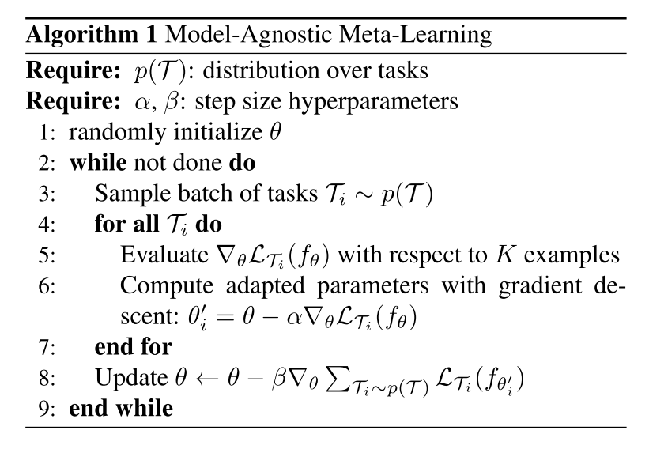
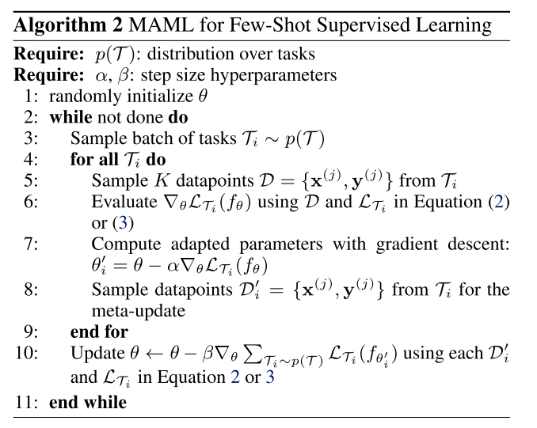
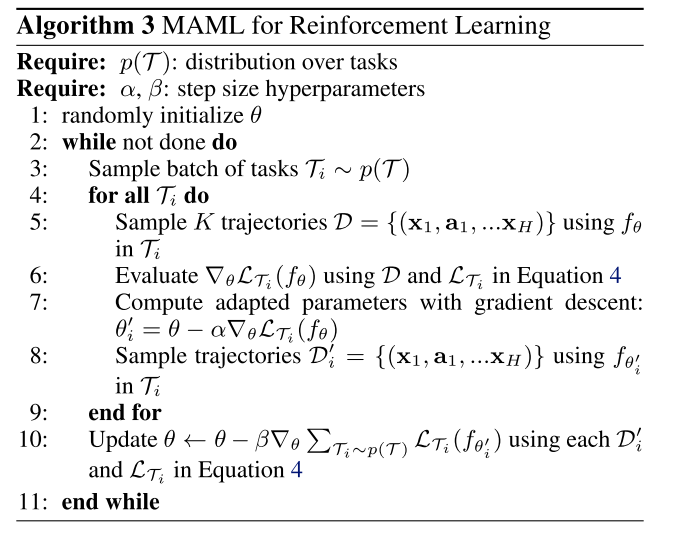

# hyper_parameter_optimization

Meta-learning can address hyperparameter optimization by considering ω to specify hyperparameters, such as regu- larization strength or learning rate. There are two main settings: we can learn hyperparameters that improve train- ing over a distribution of tasks, or hyperparameters that improve learning for a single task. The former case is usually relevant in few-shot applications, especially in optimization based methods. For instance, MAML can be improved by learning a learning rate per layer per step [76]. The case where we wish to learn hyperparameters for a single task is usually more relevant for many-shot applications [145], where some validation data can be extracted from the training dataset, as discussed in Section 2.1. Meta- learning over long inner horizons comes with memory and compute scaling issues, which is an active research area as discussed in Section 6. However, it is noteworthy that end-to-end gradient-based meta-learning has already
demonstrated promising scalability to millions of param- eters (as demonstrated by MAML [19], [145] and Dataset Distillation [144], [145], for example) in contrast to the classic approaches (such cross-validation by grid or random [69] search, or Bayesian Optimization [70]) which are usually only successful with dozens of hyper-parameters.
<!-- REFERENCE -->

[19] Model-Agnostic Meta-learning For Fast Adaptation Of Deep Networks

 
<!-- (model_agnostic_meta_learning_for_fast_adaptation_of_deep_networks.md) -->

# model_agnostic_meta_learning_for_fast_adaptation_of_deep_networks.md
## What?
- Model-agnostic meta-learning algorithm that can adapt to every gradient-based models, including classisication, 
regression, reinforcement leanring
## Why?
- To adapt to any gradient-based model
- Solve new task quickly with a few gradient steps by learning initial weights

## How?
The algorithm is shown in the images below:

- Loss function can be any frequenly used loss function for that task.
- MAML can maximize the sensitivity of the loss functions of new tasks with respect to the parameters.
## Results? (What did they find?)
- MAML can be used with any gradient-based models.
- MAML is sensitive to change in the task, such that small changes in the parameters will produce large improvements on 
the loss function.
- Perform better than transfer learning in regression tasks, because they can learn the abstract over tasks.
- State-of-the art in regression, classification, reinforcement learning 
- Without overfitting 
## Ideas to improve?
- Handle the computation problem. The paper currently use approximate method.

## Application ideas
- use meta-learning to find the initial weights for any deep learning model.
<!-- REFERENCE -->

[Model-Agnostic Meta-learning For Fast Adaptation Of Deep Networks](../papers/model_agnostic_meta_learning_for_fast_adaptation_of_deep_networks.md)

[144] Dataset Distillation

 
<!-- (dataset_distillation.md) -->

# dataset_distillation.md

<!-- REFERENCE -->

[Dataset Distillation](../papers/dataset_distillation.md)

[145] Optimizing Millions Of Hyperparameters By Implicit Differentiation

 
<!-- (optimizing_millions_of_hyperparameters_by_implicit_differentiation.md) -->

# optimizing_millions_of_hyperparameters_by_implicit_differentiation.md

<!-- REFERENCE -->

[Optimizing Millions Of Hyperparameters By Implicit Differentiation](../papers/optimizing_millions_of_hyperparameters_by_implicit_differentiation.md)

[70] Taking The Human Out Of The Loop: A Review Of Bayesian Optimization

 
<!-- (taking_the_human_out_of_the_loop_a_review_of_bayesian_optimization.md) -->

# taking_the_human_out_of_the_loop_a_review_of_bayesian_optimization.md

<!-- REFERENCE -->

[Taking The Human Out Of The Loop: A Review Of Bayesian Optimization](../papers/taking_the_human_out_of_the_loop_a_review_of_bayesian_optimization.md)

[76] How To Train Your MAML

 
<!-- (how_to_train_your_maml.md) -->

# how_to_train_your_maml.md
## What?
- Research the practical training techniques help training MAML more effective
## Why?
Disadvantage of original MAML:
- Training Instability: lack of any skip connections
- Second Order Derivative cost
- Absence of Batch Normalization Statistic Accumulation
- Shared (across step) Batch Normalization Bias
- Shared Inner Loop (across step and across parameter) Learning Rate
- Fixed Outer Loop Learning Rate
## How?
Handle these above problem:
- Gradient Instability → Multi-Step Loss Optimization (MSL): propose minimizing the target set loss computed by the base-network after every step towards a support set task,
the loss minimized is a weighted sum of the target set losses after every support set loss update, employ an annealed weighting for the per step losses.

- Second Order Derivative Cost → Derivative-Order Annealing (DA): propose to anneal the derivative-order as training progresses. More specifically, we propose to use first-order gradients for the first 50 epochs of the training phase, and to then switch to second-order gradients for the remainder of the training phase
Using first-order before starting to use second-order derivatives can be used as a strong pretraining method that learns parameters less likely to produce gradient explosion/diminishment issues.
- Absence of Batch Normalization Statistic Accumulation → Per-Step Batch Normalization Running Statistics (BNRS): instantiate N (where N is the total number of inner-loop update steps) sets of running mean and running standard deviation for each batch normalization layer in the network and update the running statistics respectively with the steps being taken during the optimization. The per-step batch normalization methodology should speed up optimization of MAML whilst potentially improving generalization performance

- Shared (across step) Batch Normalization Bias → Per-Step Batch Normalization Weights and Biases (BNWB): batch normalization will learn biases specific to the feature distributions seen at each set, which should increase convergence speed, stability and generalization performance.

- Shared Inner Loop Learning Rate (across step and across parameter) → Learning Per-Layer Per-Step Learning Rates and Gradient Directions (LSLR): we propose, learning a learning rate and direction for each layer in the network as well as learning different learning rates for each adaptation of the base-network as it takes steps

- Fixed Outer Loop Learning Rate → Cosine Annealing of Meta-Optimizer Learning Rate (CA): we propose applying the cosine annealing scheduling on the meta-model’s optimizer (i.e. the meta-optimizer)

## Results? (What did they find?)
- State of the art results, each of above techniques do improve the results
- Use validation set to get better results: ensemble of the top 3 performing per-epoch-models on the validation set were applied on the test set
## Ideas to improve?
Apply these technique when train modifications of MAML

<!-- REFERENCE -->

[How To Train Your MAML](../papers/how_to_train_your_maml.md)

[69] Random Search For Hyper-Parameter Optimization

 
<!-- (random_search_for_hyper_parameter_optimization.md) -->

# random_search_for_hyper_parameter_optimization.md

<!-- REFERENCE -->

[Random Search For Hyper-Parameter Optimization](../papers/random_search_for_hyper_parameter_optimization.md)

