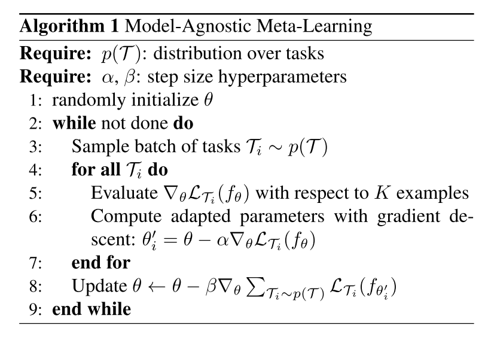
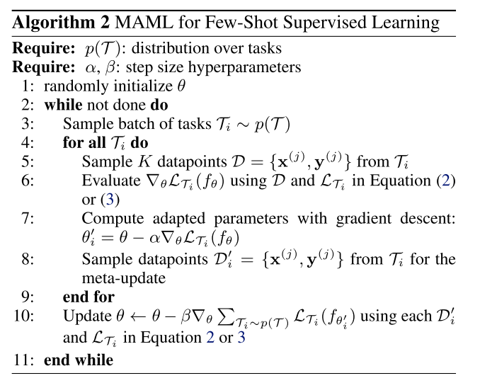

# multi_modality_of_task_distribution

Many meta-learning frameworks [19] implicitly assume that the distribution over tasks p(T) is uni-modal, and a single learning strategy ω pro- vides a good solution for them all. However in reality task distributions can clearly be multi-modal. Consider for ex- ample, medical vs satellite vs everyday images in computer vision. Or the diversity of tasks that robots could be asked to perform from putting pegs in holes to opening doors [230]. Different tasks within the distribution may require different learning strategies, and this can degrade existing meta-learner performance. In vanilla multi-task learning, this phenomenon is relatively well studied with, e.g., meth- ods that group tasks into clusters [286] or subspaces [287]. However this area is only just beginning to be explored in meta-learning [288].

<!-- REFERENCE -->

[19] Model-Agnostic Meta-learning For Fast Adaptation Of Deep Networks

 
<!-- (model_agnostic_meta_learning_for_fast_adaptation_of_deep_networks.md) -->

# model_agnostic_meta_learning_for_fast_adaptation_of_deep_networks.md
## What?
- Model-agnostic meta-learning algorithm that can adapt to every gradient-based models, including classisication, 
regression, reinforcement leanring
## Why?
- To adapt to any gradient-based model
- Solve new task quickly with a few gradient steps by learning initial weights

## How?
The algorithm is shown in the images below:

- Loss function can be any frequenly used loss function for that task.
- MAML can maximize the sensitivity of the loss functions of new tasks with respect to the parameters.
## Results? (What did they find?)
- MAML can be used with any gradient-based models.
- MAML is sensitive to change in the task, such that small changes in the parameters will produce large improvements on 
the loss function.
- Perform better than transfer learning in regression tasks, because they can learn the abstract over tasks.
- State-of-the art in regression, classification, reinforcement learning 
- Without overfitting 
## Ideas to improve?
- Handle the computation problem. The paper currently use approximate method.

## Application ideas
- use meta-learning to find the initial weights for any deep learning model.
<!-- REFERENCE -->

[Model-Agnostic Meta-learning For Fast Adaptation Of Deep Networks](../papers/model_agnostic_meta_learning_for_fast_adaptation_of_deep_networks.md)

[287] A Unified Perspective On MultiDomain And Multi-Task Learning

 
<!-- (a_unified_perspective_on_multidomain_and_multi_task_learning.md) -->

# a_unified_perspective_on_multidomain_and_multi_task_learning.md

<!-- REFERENCE -->

[A Unified Perspective On MultiDomain And Multi-Task Learning](../papers/a_unified_perspective_on_multidomain_and_multi_task_learning.md)

[288] Infinite Mixture Prototypes For Few-shot Learning

 
<!-- (infinite_mixture_prototypes_for_few_shot_learning.md) -->

# infinite_mixture_prototypes_for_few_shot_learning.md

<!-- REFERENCE -->

[Infinite Mixture Prototypes For Few-shot Learning](../papers/infinite_mixture_prototypes_for_few_shot_learning.md)

[230] Meta-world: A Benchmark And Evaluation For Multitask And Meta Reinforcement Learning

 
<!-- (meta_world_a_benchmark_and_evaluation_for_multitask_and_meta_reinforcement_learning.md) -->

# meta_world_a_benchmark_and_evaluation_for_multitask_and_meta_reinforcement_learning.md

<!-- REFERENCE -->

[Meta-world: A Benchmark And Evaluation For Multitask And Meta Reinforcement Learning](../papers/meta_world_a_benchmark_and_evaluation_for_multitask_and_meta_reinforcement_learning.md)

[286] Learning With Whom To Share In Multi-task Feature Learning

 
<!-- (learning_with_whom_to_share_in_multi_task_feature_learning.md) -->

# learning_with_whom_to_share_in_multi_task_feature_learning.md

<!-- REFERENCE -->

[Learning With Whom To Share In Multi-task Feature Learning](../papers/learning_with_whom_to_share_in_multi_task_feature_learning.md)

