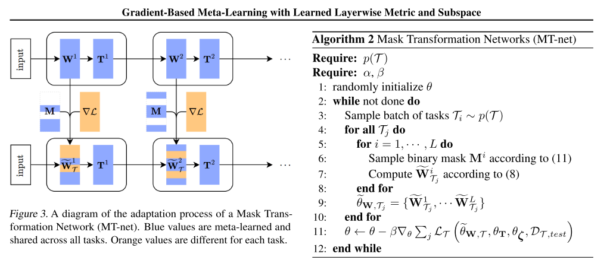

# gradient_based_meta_learning_with_learned_layerwise_metric_and_subspace.md
## What?
- MT-net: which enables the meta-learner to learn on each layer’s activation space a subspace that the task-specific learner performs gradient descent on.
## Why?
- reduce the sensitivity to the choice of initial learning rates than previous gradient-based meta-learning methods
## How?
- Basic idea: Separate the parameters to 2 groups: 
    - T: will not be updated in learner, and be shared across task-specific model. 
    - W: will be updated in learner
- Use a mask to determine wich parameters are to be updated.
- By doing this, we can specify that T is use as general knowledge

## Results? (What did they find?)

## Ideas to improve?
<!-- REFERENCE -->
