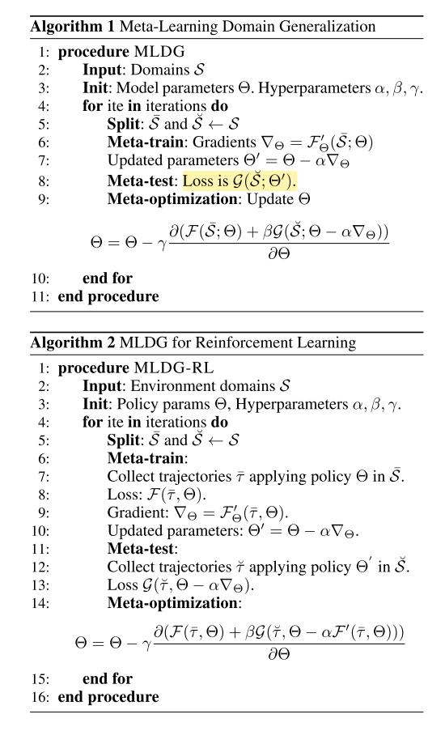

# learning_to_generalize_meta_learning_for_domain_generalization.md
## What?
Apply meta learning method (MAML) for Domain Generalization problem
## Why?
- Reduce number of parameters and does not require training with high computation cost as previous methods:
    - The simplest approach is to train a model for each source domain. When a testing do-built on three main strategies. The simplest approach is to train a model for each source domain. When a testing do- main comes, estimate the most relevant source domain and train a model for each source domain. When a testing do- main comes, estimate the most relevant source domain and use that classifier (Xu et al. 2014). A second approach is main comes, estimate the most relevant source domain and use that classifier (Xu et al. 2014). A second approach is to presume that any
    - A second approach is to presume that any domain is composed of an underlying globally shared factor and a domain specific component. By factoring out the domain specific and domain-agnostic component during training on source domains, the domain- agnostic component can be extracted and transferred as a model that is likely to work on a new source domain
    
## How?
- Apply MAML directly to Domain Generalization

## Results? (What did they find?)
- Achieve better results compare to previous methods
- Model-agnostic
- Can be applied both supervised learning and reinforcement learning
- Scale well with number of domains

## Ideas to improve?
- Try to apply another variations of MAML to the Domain Generalization problem.
<!-- REFERENCE -->
