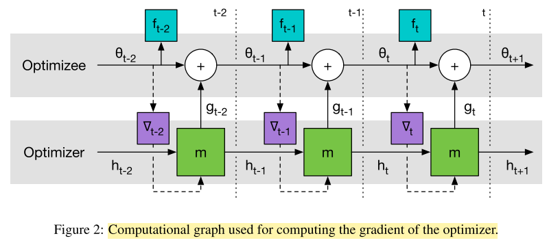

# learning_to_learn_by_gradient_descent_by_gradient_descent.md
## What?
- Design an optimization algorithm by using LSTM, compare to hand-designed ones such as Adam, SGD, ...
## Why?
- Automatically design an optimization algorithm
## How?
- Design new update rule using RNN: 

## Results? (What did they find?)
- The found optimizer is more effective than all optimizers and the optimizer can be used in other problem such as classifications, 
regression, style transfer, etc.
## Ideas to improve?
- Use the idea of changing the update rule in other framework, such as MAML

<!-- REFERENCE -->
