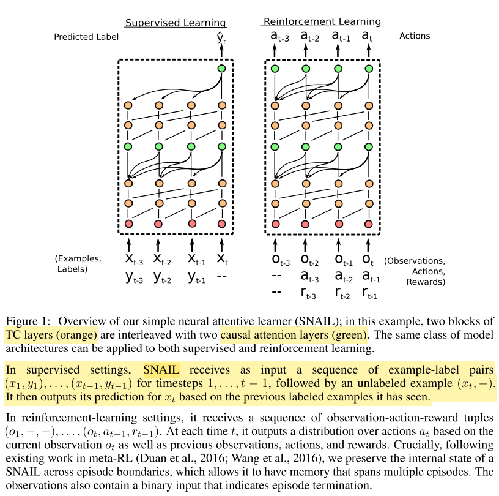
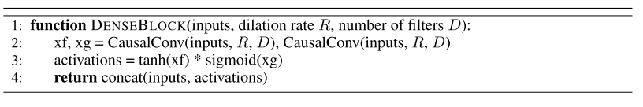
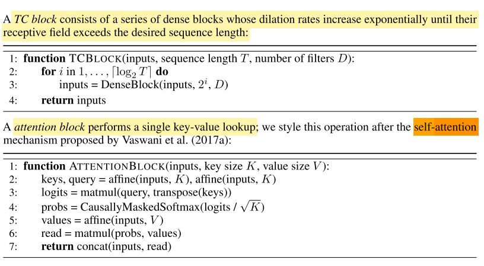
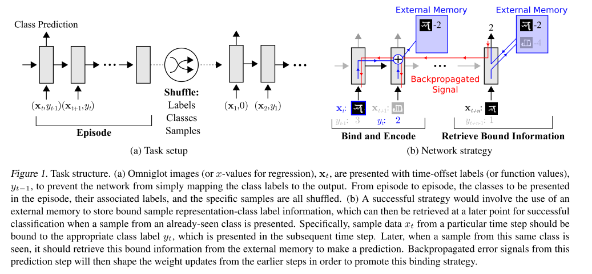

# black_box_model_based

In model-based (or black-box) methods the inner learning step (Eq. 6, Eq. 4) is wrapped up in the feed-forward pass of a single model, as illustrated in Eq. 7. The model embeds the current dataset D into activation state, with predictions for test data being made based on this state. Typical architectures include recurrent networks [41], [51], convolutional networks [40] or hyper- networks [79], [80] that embed training instances and labels of a given task to define a predictor that inputs testing example and predicts its label. In this case all the inner- level learning is contained in the activation states of the model and is entirely feed-forward. Outer-level learning is performed with ω containing the CNN, RNN or hyper- network parameters. The outer and inner-level optimiza- tions are tightly coupled as ω directly specifies θ. Memory- augmented neural networks [81] use an explicit storage buffer and can also be used as a model-based algorithm [82], [83]. It has been observed that model-based approaches are usually less able to generalize to out-of-distribution tasks than optimization-based methods [84]. Furthermore, while they are often very good at data efficient few-shot learning, they have been criticised for being asymptotically weaker
[84] as it isn’t clear that black-box models can successfully embed a large training set into a rich base model.
<!-- REFERENCE -->

[81] Neural Turing Machines

 
<!-- (neural_turing_machines.md) -->

# neural_turing_machines.md
## What?
- Neural Network Turing Machine 
- differentiable end-to- end, allowing it to be efficiently trained with gradient descent
## Why?
- intergrate the memory into neural network
## How?
(read the paper)
## Results? (What did they find?)
- better than LSTM in some task such as: copy, recall, sorting,...
## Ideas to improve?
<!-- REFERENCE -->

[Neural Turing Machines](../papers/neural_turing_machines.md)

[40] A Simple Neural Attentive Meta-learner

 
<!-- (a_simple_neural_attentive_meta_learner.md) -->

# a_simple_neural_attentive_meta_learner.md
## What?
- A meta-learner architecture that use a novel combination of temporal convolutions and soft attention; the former to aggregate information from past experience and the latter to pinpoint specific pieces of information.
## Why?
- Handle the problems: architectures specialized to a particular application, or hard-coding algorithmic components that constrain how the meta-learner solves the task
## How?

## Results? (What did they find?)
- Effective black-box using self attention 
- Note:
    - trained the SNAIL on episodes where the number of shots K was chosen uniformly at random from 1 to 5 (note that this is unlike prior works, who train separate models for each shot)
    - complicated architecture, not sure that can compare with original MAML
## Ideas to improve?

<!-- REFERENCE -->

[A Simple Neural Attentive Meta-learner](../papers/a_simple_neural_attentive_meta_learner.md)

[51] Learning To Learn Using Gradient Descent

 
<!-- (learning_to_learn_using_gradient_descent.md) -->

# learning_to_learn_using_gradient_descent.md

<!-- REFERENCE -->

[Learning To Learn Using Gradient Descent](../papers/learning_to_learn_using_gradient_descent.md)

[82] Meta Learning With Memory-Augmented Neural Networks

 
<!-- (meta_learning_with_memory_augmented_neural_networks.md) -->

# meta_learning_with_memory_augmented_neural_networks.md
## What?
- A memory-augmented neural network that can use the external memory to store the knowledge
## Why?
- Almost neural network just stores the internal memory, such as RNN, LSTM, etc.
## How?
- Incorporate Neural Turing Machine 
- Use Least Recently Used Access to write to memory, which can emphasize a conjunctive coding of information independent of sequence.

## Results? (What did they find?)
- Useful for few-shot learning problem
- Use external memory for neural network
## Ideas to improve?
<!-- REFERENCE -->

[Meta Learning With Memory-Augmented Neural Networks](../papers/meta_learning_with_memory_augmented_neural_networks.md)

[41] Optimization As A Model For FewShot Learning

 
<!-- (optimization_as_a_model_for_fewshot_learning.md) -->

# optimization_as_a_model_for_fewshot_learning.md
## What?
- LSTM based meta-learner model to learn the exact optimization algorithm used to train another learner neural network classifier in the few-shot regime.
## Why?
- Handle the few-shot learning problem, the model can transfer 
## How?
This model based on the LSTM, the model modified the update rule of gradient from: 

to 

if  and 

But we can learn the  and 

and

and also we can learn the initial weights of learner, allows the optimization process more rapid.

## Results? (What did they find?)
- Apply the LSTM to learn the learning updates of the parameters of classifier.
- Can learn the good initialization parameters and update rules.
## Ideas to improve?
- The paper shows that by learning and modify the update rules, we could get better results. Could we use this idea?

<!-- REFERENCE -->

[Optimization As A Model For FewShot Learning](../papers/optimization_as_a_model_for_fewshot_learning.md)

[83] Meta Networks

 
<!-- (meta_networks.md) -->

# meta_networks.md

<!-- REFERENCE -->

[Meta Networks](../papers/meta_networks.md)

[79] Few-Shot Image Recognition By Predicting Parameters From Activations

 
<!-- (few_shot_image_recognition_by_predicting_parameters_from_activations.md) -->

# few_shot_image_recognition_by_predicting_parameters_from_activations.md

<!-- REFERENCE -->

[Few-Shot Image Recognition By Predicting Parameters From Activations](../papers/few_shot_image_recognition_by_predicting_parameters_from_activations.md)

[84] Meta-Learning And Universality: Deep Representations And Gradient Descent Can Approximate Any Learning Algorithm

 
<!-- (meta_learning_and_universality_deep_representations_and_gradient_descent_can_approximate_any_learning_algorithm.md) -->

# meta_learning_and_universality_deep_representations_and_gradient_descent_can_approximate_any_learning_algorithm.md
## What?
- Prove that MAML could be a an universal function, which can approximate any learning algorithms
## Why?
- Other RNN methods in meta-learning are universal functions. 
- To find out how much MAML can generalize
## How?
- The approximate function of MAML depends on first-order derivative, not normal functions.
- The authors prove the universality of MAML (read in paper)
## Results? (What did they find?)
- There exists a form of deep neural network such that the initial weights combined with gradient descent can approximate any learning algorithm.
- the representations acquired with MAML are highly resilient to overfitting
- But it still depends on type of loss function.
## Ideas to improve?
<!-- REFERENCE -->

[Meta-Learning And Universality: Deep Representations And Gradient Descent Can Approximate Any Learning Algorithm](../papers/meta_learning_and_universality_deep_representations_and_gradient_descent_can_approximate_any_learning_algorithm.md)

[80] Dynamic Few-Shot Visual Learning Without Forgetting

 
<!-- (dynamic_few_shot_visual_learning_without_forgetting.md) -->

# dynamic_few_shot_visual_learning_without_forgetting.md

<!-- REFERENCE -->

[Dynamic Few-Shot Visual Learning Without Forgetting](../papers/dynamic_few_shot_visual_learning_without_forgetting.md)

