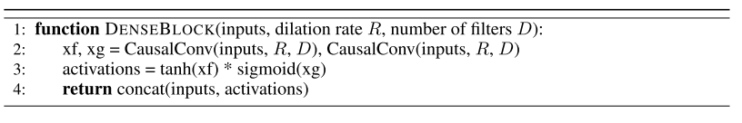

# black_box_models

Another family of models trains learners ω that provide a feed-forward mapping directly from the support set to the parameters required to classify test instances, i.e., 

– rather than relying on gradient [78] (or zero-order [104]) iterative optimization of θ. These correspond to the black-box model-based learning in the conventional taxonomy (Section 3.1). Embedding the sup- port set is commonly achieved by recurrent networks [51], [105], [106] or convolution [40]. These methods have strong connections to Hypernet-
works. Hypernetworks [107], [108] are networks that gen- erate the weights of another neural network conditioned on some embedding – and are often used for compression or multi-task learning. Hypernetworks can also be used to synthesize predictive models by conditioning on an em- bedding of the source (aka. support) dataset [97], [109]. In this case ω is the weight synthesis hypernetwork that produces θ given a support set in a feed-forward pass. Fi- nally, memory-augmented neural networks have the ability to remember old data and assimilate new data quickly, and typically fall in the black-box model category as well. In [82], the authors adapt Neural Turing Machines [81] to the meta-learning setting by changing their memory retrieval mechanism. Meta networks [83] then improve on this model by combining fast weights (predicted per task by a network)
and slow weights (trained with REINFORCE across tasks) to access memory. We note that some methods implement both model-based and initial-condition [97] or optimizer-centric [98] meta-learning in a single framework
<!-- REFERENCE -->

[81] Neural Turing Machines

 
<!-- (neural_turing_machines.md) -->

# neural_turing_machines.md
## What?
- Neural Network Turing Machine 
- differentiable end-to- end, allowing it to be efficiently trained with gradient descent
## Why?
- intergrate the memory into neural network
## How?
(read the paper)
## Results? (What did they find?)
- better than LSTM in some task such as: copy, recall, sorting,...
## Ideas to improve?
<!-- REFERENCE -->

[Neural Turing Machines](../papers/neural_turing_machines.md)

[107] HyperNetworks

 
<!-- (hypernetworks.md) -->

# hypernetworks.md

<!-- REFERENCE -->

[HyperNetworks](../papers/hypernetworks.md)

[78] Learning To Learn By Gradient Descent By Gradient Descent

 
<!-- (learning_to_learn_by_gradient_descent_by_gradient_descent.md) -->

# learning_to_learn_by_gradient_descent_by_gradient_descent.md
## What?
- Design an optimization algorithm by using LSTM, compare to hand-designed ones such as Adam, SGD, ...
## Why?
- Automatically design an optimization algorithm
## How?
- Design new update rule using RNN: 

## Results? (What did they find?)
- The found optimizer is more effective than all optimizers and the optimizer can be used in other problem such as classifications, 
regression, style transfer, etc.
## Ideas to improve?
- Use the idea of changing the update rule in other framework, such as MAML

<!-- REFERENCE -->

[Learning To Learn By Gradient Descent By Gradient Descent](../papers/learning_to_learn_by_gradient_descent_by_gradient_descent.md)

[97] Meta-Learning With Latent Embedding Optimization

 
<!-- (meta_learning_with_latent_embedding_optimization.md) -->

# meta_learning_with_latent_embedding_optimization.md

<!-- REFERENCE -->

[Meta-Learning With Latent Embedding Optimization](../papers/meta_learning_with_latent_embedding_optimization.md)

[109] Efficient Off-Policy Meta-Reinforcement Learning Via Probabilistic Context Variables

 
<!-- (efficient_off_policy_meta_reinforcement_learning_via_probabilistic_context_variables.md) -->

# efficient_off_policy_meta_reinforcement_learning_via_probabilistic_context_variables.md

<!-- REFERENCE -->

[Efficient Off-Policy Meta-Reinforcement Learning Via Probabilistic Context Variables](../papers/efficient_off_policy_meta_reinforcement_learning_via_probabilistic_context_variables.md)

[105] One-shot Imitation Learning

 
<!-- (one_shot_imitation_learning.md) -->

# one_shot_imitation_learning.md

<!-- REFERENCE -->

[One-shot Imitation Learning](../papers/one_shot_imitation_learning.md)

[40] A Simple Neural Attentive Meta-learner

 
<!-- (a_simple_neural_attentive_meta_learner.md) -->

# a_simple_neural_attentive_meta_learner.md
## What?
- A meta-learner architecture that use a novel combination of temporal convolutions and soft attention; the former to aggregate information from past experience and the latter to pinpoint specific pieces of information.
## Why?
- Handle the problems: architectures specialized to a particular application, or hard-coding algorithmic components that constrain how the meta-learner solves the task
## How?

## Results? (What did they find?)
- Effective black-box using self attention 
- Note:
    - trained the SNAIL on episodes where the number of shots K was chosen uniformly at random from 1 to 5 (note that this is unlike prior works, who train separate models for each shot)
    - complicated architecture, not sure that can compare with original MAML
## Ideas to improve?

<!-- REFERENCE -->

[A Simple Neural Attentive Meta-learner](../papers/a_simple_neural_attentive_meta_learner.md)

[51] Learning To Learn Using Gradient Descent

 
<!-- (learning_to_learn_using_gradient_descent.md) -->

# learning_to_learn_using_gradient_descent.md

<!-- REFERENCE -->

[Learning To Learn Using Gradient Descent](../papers/learning_to_learn_using_gradient_descent.md)

[104] Learning To Learn Without Gradient Descent By Gradient Descent

 
<!-- (learning_to_learn_without_gradient_descent_by_gradient_descent.md) -->

# learning_to_learn_without_gradient_descent_by_gradient_descent.md

<!-- REFERENCE -->

[Learning To Learn Without Gradient Descent By Gradient Descent](../papers/learning_to_learn_without_gradient_descent_by_gradient_descent.md)

[82] Meta Learning With Memory-Augmented Neural Networks

 
<!-- (meta_learning_with_memory_augmented_neural_networks.md) -->

# meta_learning_with_memory_augmented_neural_networks.md
## What?
- A memory-augmented neural network that can use the external memory to store the knowledge
## Why?
- Almost neural network just stores the internal memory, such as RNN, LSTM, etc.
## How?
- Incorporate Neural Turing Machine 
- Use Least Recently Used Access to write to memory, which can emphasize a conjunctive coding of information independent of sequence.

## Results? (What did they find?)
- Useful for few-shot learning problem
- Use external memory for neural network
## Ideas to improve?
<!-- REFERENCE -->

[Meta Learning With Memory-Augmented Neural Networks](../papers/meta_learning_with_memory_augmented_neural_networks.md)

[98] Learning To Learn By SelfCritique

 
<!-- (learning_to_learn_by_selfcritique.md) -->

# learning_to_learn_by_selfcritique.md

<!-- REFERENCE -->

[Learning To Learn By SelfCritique](../papers/learning_to_learn_by_selfcritique.md)

[83] Meta Networks

 
<!-- (meta_networks.md) -->

# meta_networks.md

<!-- REFERENCE -->

[Meta Networks](../papers/meta_networks.md)

[108] SMASH: OneShot Model Architecture Search Through Hypernetworks

 
<!-- (smash_oneshot_model_architecture_search_through_hypernetworks.md) -->

# smash_oneshot_model_architecture_search_through_hypernetworks.md

<!-- REFERENCE -->

[SMASH: OneShot Model Architecture Search Through Hypernetworks](../papers/smash_oneshot_model_architecture_search_through_hypernetworks.md)

[106] Learning To Reinforcement Learn

 
<!-- (learning_to_reinforcement_learn.md) -->

# learning_to_reinforcement_learn.md

<!-- REFERENCE -->

[Learning To Reinforcement Learn](../papers/learning_to_reinforcement_learn.md)

