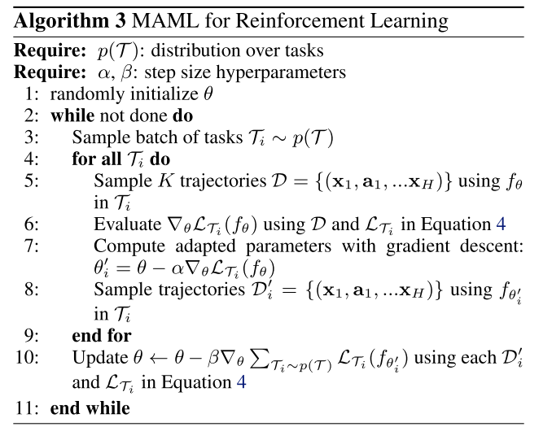

# multi_vs_single_task
When the goal is to tune the learner to better solve any task drawn from a given family, then inner loop learning episodes correspond to a randomly drawn task from p(T) [19], [20], [44]. When the goal is to tune the learner to simply solve one specific task better, then
the inner loop learning episodes all draw data from the same underlying task [67], [78], [162], [167], [168], [185]. It is worth noting that these two meta-objectives tend
to have different assumptions and value propositions. The multi-task objective obviously requires a task family p(T) to work with, which single-task does not. Meanwhile for multi-task, the data and compute cost of meta-training can be amortized by potentially boosting the performance of multiple target tasks during meta-test; but single-task – without the new tasks for amortization – needs to improve the final solution or asymptotic performance of the current task, or meta-learn fast enough to be online.
<!-- REFERENCE -->

[19] Model-Agnostic Meta-learning For Fast Adaptation Of Deep Networks

 
<!-- (model_agnostic_meta_learning_for_fast_adaptation_of_deep_networks.md) -->

# model_agnostic_meta_learning_for_fast_adaptation_of_deep_networks.md
## What?
- Model-agnostic meta-learning algorithm that can adapt to every gradient-based models, including classisication, 
regression, reinforcement leanring
## Why?
- To adapt to any gradient-based model
- Solve new task quickly with a few gradient steps by learning initial weights

## How?
The algorithm is shown in the images below:

- Loss function can be any frequenly used loss function for that task.
- MAML can maximize the sensitivity of the loss functions of new tasks with respect to the parameters.
## Results? (What did they find?)
- MAML can be used with any gradient-based models.
- MAML is sensitive to change in the task, such that small changes in the parameters will produce large improvements on 
the loss function.
- Perform better than transfer learning in regression tasks, because they can learn the abstract over tasks.
- State-of-the art in regression, classification, reinforcement learning 
- Without overfitting 
## Ideas to improve?
- Handle the computation problem. The paper currently use approximate method.

## Application ideas
- use meta-learning to find the initial weights for any deep learning model.
<!-- REFERENCE -->

[Model-Agnostic Meta-learning For Fast Adaptation Of Deep Networks](../papers/model_agnostic_meta_learning_for_fast_adaptation_of_deep_networks.md)

[20] Prototypical Networks For Few Shot Learning

 
<!-- (prototypical_networks_for_few_shot_learning.md) -->

# prototypical_networks_for_few_shot_learning.md

<!-- REFERENCE -->

[Prototypical Networks For Few Shot Learning](../papers/prototypical_networks_for_few_shot_learning.md)

[78] Learning To Learn By Gradient Descent By Gradient Descent

 
<!-- (learning_to_learn_by_gradient_descent_by_gradient_descent.md) -->

# learning_to_learn_by_gradient_descent_by_gradient_descent.md
## What?
- Design an optimization algorithm by using LSTM, compare to hand-designed ones such as Adam, SGD, ...
## Why?
- Automatically design an optimization algorithm
## How?
- Design new update rule using RNN: 

## Results? (What did they find?)
- The found optimizer is more effective than all optimizers and the optimizer can be used in other problem such as classifications, 
regression, style transfer, etc.
## Ideas to improve?
- Use the idea of changing the update rule in other framework, such as MAML

<!-- REFERENCE -->

[Learning To Learn By Gradient Descent By Gradient Descent](../papers/learning_to_learn_by_gradient_descent_by_gradient_descent.md)

[185] Online Learning Of A Memory For Learning Rates

 
<!-- (online_learning_of_a_memory_for_learning_rates.md) -->

# online_learning_of_a_memory_for_learning_rates.md

<!-- REFERENCE -->

[Online Learning Of A Memory For Learning Rates](../papers/online_learning_of_a_memory_for_learning_rates.md)

[162] Meta-Gradient Reinforcement Learning

 
<!-- (meta_gradient_reinforcement_learning.md) -->

# meta_gradient_reinforcement_learning.md

<!-- REFERENCE -->

[Meta-Gradient Reinforcement Learning](../papers/meta_gradient_reinforcement_learning.md)

[167] Discovery Of Useful Questions As Auxiliary Tasks

 
<!-- (discovery_of_useful_questions_as_auxiliary_tasks.md) -->

# discovery_of_useful_questions_as_auxiliary_tasks.md

<!-- REFERENCE -->

[Discovery Of Useful Questions As Auxiliary Tasks](../papers/discovery_of_useful_questions_as_auxiliary_tasks.md)

[168] On Learning Intrinsic Rewards For Policy Gradient Methods

 
<!-- (on_learning_intrinsic_rewards_for_policy_gradient_methods.md) -->

# on_learning_intrinsic_rewards_for_policy_gradient_methods.md

<!-- REFERENCE -->

[On Learning Intrinsic Rewards For Policy Gradient Methods](../papers/on_learning_intrinsic_rewards_for_policy_gradient_methods.md)

[44] Feature-Critic Networks For Heterogeneous Domain Generalization

 
<!-- (feature_critic_networks_for_heterogeneous_domain_generalization.md) -->

# feature_critic_networks_for_heterogeneous_domain_generalization.md

<!-- REFERENCE -->

[Feature-Critic Networks For Heterogeneous Domain Generalization](../papers/feature_critic_networks_for_heterogeneous_domain_generalization.md)

[67] Forward And Reverse Gradient-Based Hyperparameter Optimization

 
<!-- (forward_and_reverse_gradient_based_hyperparameter_optimization.md) -->

# forward_and_reverse_gradient_based_hyperparameter_optimization.md

<!-- REFERENCE -->

[Forward And Reverse Gradient-Based Hyperparameter Optimization](../papers/forward_and_reverse_gradient_based_hyperparameter_optimization.md)

