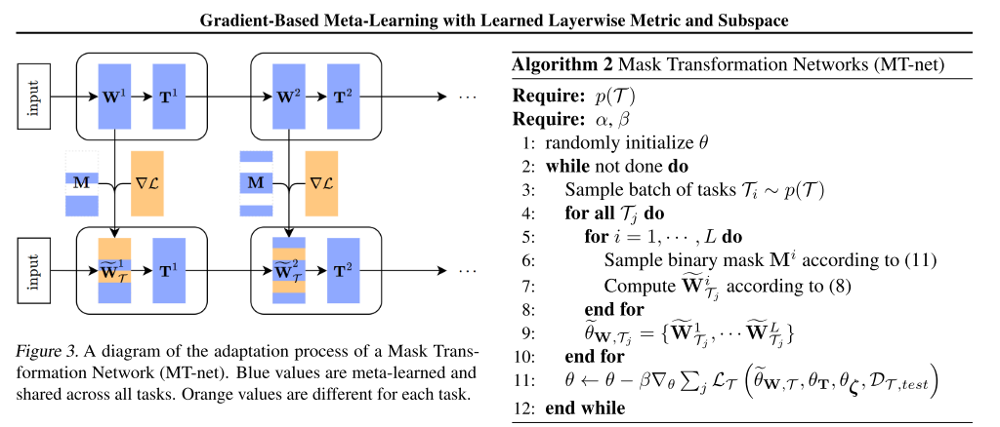
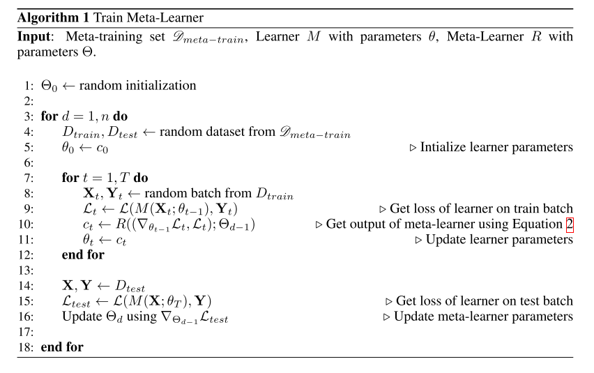

# optimization
Previous [73], [74] categorizations of meta-learning meth- ods have tended to produce a three-way taxonomy across optimization-based methods, model-based (or black box) methods, and metric-based (or non-parametric) methods. Optimization Optimization-based methods include those where the inner-level task (Eq. 6) is literally solved as an optimization problem, and focuses on extracting meta- knowledge ω required to improve optimization perfor- mance. The most famous of these is perhaps MAML [19], where the meta-knowledge ω is the initialization of the model parameters in the inner optimization, namely θ0. The goal is to learn θ0 such that a small number of inner steps on a small number of train instances produces a classifier that performs well on validation data. This is also performed by gradient descent, differentiating through the updates to the base model. More elaborate alternatives also learn step sizes [75], [76] or train recurrent networks to predict steps from gradients [41], [77], [78]. Meta-optimization by gradi- ent leads to the challenge of efficiently evaluating expen- sive second-order derivatives and differentiating through a graph of potentially thousands of inner optimization steps (see Section 6). For this reason it is often applied to few-shot learning where few inner-loop steps may be sufficient
<!-- REFERENCE -->

[19] Model-Agnostic Meta-learning For Fast Adaptation Of Deep Networks

 
<!-- (model_agnostic_meta_learning_for_fast_adaptation_of_deep_networks.md) -->

# model_agnostic_meta_learning_for_fast_adaptation_of_deep_networks.md
## What?
- Model-agnostic meta-learning algorithm that can adapt to every gradient-based models, including classisication, 
regression, reinforcement leanring
## Why?
- To adapt to any gradient-based model
- Solve new task quickly with a few gradient steps by learning initial weights

## How?
The algorithm is shown in the images below:

- Loss function can be any frequenly used loss function for that task.
- MAML can maximize the sensitivity of the loss functions of new tasks with respect to the parameters.
## Results? (What did they find?)
- MAML can be used with any gradient-based models.
- MAML is sensitive to change in the task, such that small changes in the parameters will produce large improvements on 
the loss function.
- Perform better than transfer learning in regression tasks, because they can learn the abstract over tasks.
- State-of-the art in regression, classification, reinforcement learning 
- Without overfitting 
## Ideas to improve?
- Handle the computation problem. The paper currently use approximate method.

## Application ideas
- use meta-learning to find the initial weights for any deep learning model.
<!-- REFERENCE -->

[Model-Agnostic Meta-learning For Fast Adaptation Of Deep Networks](../papers/model_agnostic_meta_learning_for_fast_adaptation_of_deep_networks.md)

[74] Gradient-Based Meta-Learning With Learned Layerwise Metric And Subspace

 
<!-- (gradient_based_meta_learning_with_learned_layerwise_metric_and_subspace.md) -->

# gradient_based_meta_learning_with_learned_layerwise_metric_and_subspace.md
## What?
- MT-net: which enables the meta-learner to learn on each layer’s activation space a subspace that the task-specific learner performs gradient descent on.
## Why?
- reduce the sensitivity to the choice of initial learning rates than previous gradient-based meta-learning methods
## How?
- Basic idea: Separate the parameters to 2 groups: 
    - T: will not be updated in learner, and be shared across task-specific model. 
    - W: will be updated in learner
- Use a mask to determine wich parameters are to be updated.
- By doing this, we can specify that T is use as general knowledge

## Results? (What did they find?)

## Ideas to improve?
<!-- REFERENCE -->

[Gradient-Based Meta-Learning With Learned Layerwise Metric And Subspace](../papers/gradient_based_meta_learning_with_learned_layerwise_metric_and_subspace.md)

[73] Automated Relational Meta-learning

 
<!-- (automated_relational_meta_learning.md) -->

# automated_relational_meta_learning.md
## What?
- automated relational meta-learning (ARML) framework that automat- ically extracts the cross-task relations and constructs the meta-knowledge graph
## Why?
- the task heterogeneity which cannot be well handled by traditional globally shared meta-learning methods. 
## How?
- Propose using graph to store the meta-knowledge, this knowledge will be constructed automatically and used to extract 
the relation information.

## Results? (What did they find?)
- better performance compare to original MAML
## Ideas to improve?
- Use this graph with MAML++
<!-- REFERENCE -->

[Automated Relational Meta-learning](../papers/automated_relational_meta_learning.md)

[78] Learning To Learn By Gradient Descent By Gradient Descent

 
<!-- (learning_to_learn_by_gradient_descent_by_gradient_descent.md) -->

# learning_to_learn_by_gradient_descent_by_gradient_descent.md
## What?
- Design an optimization algorithm by using LSTM, compare to hand-designed ones such as Adam, SGD, ...
## Why?
- Automatically design an optimization algorithm
## How?
- Design new update rule using RNN: 

## Results? (What did they find?)
- The found optimizer is more effective than all optimizers and the optimizer can be used in other problem such as classifications, 
regression, style transfer, etc.
## Ideas to improve?
- Use the idea of changing the update rule in other framework, such as MAML

<!-- REFERENCE -->

[Learning To Learn By Gradient Descent By Gradient Descent](../papers/learning_to_learn_by_gradient_descent_by_gradient_descent.md)

[77] Learning To Optimize

 
<!-- (learning_to_optimize.md) -->

# learning_to_optimize.md
(have not read)
## What?
explore automating algorithm design and present a method to learn an optimization algorithm
## Why?

## How?

## Results? (What did they find?)

## Ideas to improve?
<!-- REFERENCE -->

[Learning To Optimize](../papers/learning_to_optimize.md)

[75] Meta-SGD: Learning To Learn Quickly For Few Shot Learning

 
<!-- (meta_sgd_learning_to_learn_quickly_for_few_shot_learning.md) -->

# meta_sgd_learning_to_learn_quickly_for_few_shot_learning.md
## What?
- Propose a methods that can learn to update the MAML more efficient, such as: directions and learning rates
## Why?
- MAML is using the same learning rate for all parameters -> slow convergence, not accurate
## How?
- Using one learning rate for each parameter, these learning rates can be learned by meta-learner.

## Results? (What did they find?)
- Better performance, because of learning learning rate value and direction
## Ideas to improve?
- arbitrary function with learning rate, i.e: 

f is an arbitrary function such as neutral network, it is not mathematically theory, but let's try. 
<!-- REFERENCE -->

[Meta-SGD: Learning To Learn Quickly For Few Shot Learning](../papers/meta_sgd_learning_to_learn_quickly_for_few_shot_learning.md)

[41] Optimization As A Model For FewShot Learning

 
<!-- (optimization_as_a_model_for_fewshot_learning.md) -->

# optimization_as_a_model_for_fewshot_learning.md
## What?
- LSTM based meta-learner model to learn the exact optimization algorithm used to train another learner neural network classifier in the few-shot regime.
## Why?
- Handle the few-shot learning problem, the model can transfer 
## How?
This model based on the LSTM, the model modified the update rule of gradient from: 

to 

if  and 

But we can learn the  and 

and

and also we can learn the initial weights of learner, allows the optimization process more rapid.

## Results? (What did they find?)
- Apply the LSTM to learn the learning updates of the parameters of classifier.
- Can learn the good initialization parameters and update rules.
## Ideas to improve?
- The paper shows that by learning and modify the update rules, we could get better results. Could we use this idea?

<!-- REFERENCE -->

[Optimization As A Model For FewShot Learning](../papers/optimization_as_a_model_for_fewshot_learning.md)

[76] How To Train Your MAML

 
<!-- (how_to_train_your_maml.md) -->

# how_to_train_your_maml.md
## What?
- Research the practical training techniques help training MAML more effective
## Why?
Disadvantage of original MAML:
- Training Instability: lack of any skip connections
- Second Order Derivative cost
- Absence of Batch Normalization Statistic Accumulation
- Shared (across step) Batch Normalization Bias
- Shared Inner Loop (across step and across parameter) Learning Rate
- Fixed Outer Loop Learning Rate
## How?
Handle these above problem:
- Gradient Instability → Multi-Step Loss Optimization (MSL): propose minimizing the target set loss computed by the base-network after every step towards a support set task,
the loss minimized is a weighted sum of the target set losses after every support set loss update, employ an annealed weighting for the per step losses.

- Second Order Derivative Cost → Derivative-Order Annealing (DA): propose to anneal the derivative-order as training progresses. More specifically, we propose to use first-order gradients for the first 50 epochs of the training phase, and to then switch to second-order gradients for the remainder of the training phase
Using first-order before starting to use second-order derivatives can be used as a strong pretraining method that learns parameters less likely to produce gradient explosion/diminishment issues.
- Absence of Batch Normalization Statistic Accumulation → Per-Step Batch Normalization Running Statistics (BNRS): instantiate N (where N is the total number of inner-loop update steps) sets of running mean and running standard deviation for each batch normalization layer in the network and update the running statistics respectively with the steps being taken during the optimization. The per-step batch normalization methodology should speed up optimization of MAML whilst potentially improving generalization performance

- Shared (across step) Batch Normalization Bias → Per-Step Batch Normalization Weights and Biases (BNWB): batch normalization will learn biases specific to the feature distributions seen at each set, which should increase convergence speed, stability and generalization performance.

- Shared Inner Loop Learning Rate (across step and across parameter) → Learning Per-Layer Per-Step Learning Rates and Gradient Directions (LSLR): we propose, learning a learning rate and direction for each layer in the network as well as learning different learning rates for each adaptation of the base-network as it takes steps

- Fixed Outer Loop Learning Rate → Cosine Annealing of Meta-Optimizer Learning Rate (CA): we propose applying the cosine annealing scheduling on the meta-model’s optimizer (i.e. the meta-optimizer)

## Results? (What did they find?)
- State of the art results, each of above techniques do improve the results
- Use validation set to get better results: ensemble of the top 3 performing per-epoch-models on the validation set were applied on the test set
## Ideas to improve?
Apply these technique when train modifications of MAML

<!-- REFERENCE -->

[How To Train Your MAML](../papers/how_to_train_your_maml.md)

