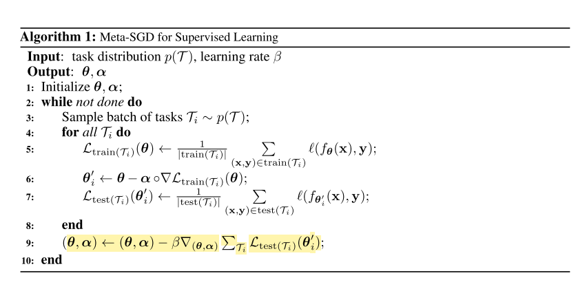

# Optimizer

The above parameter-centric methods usually rely on existing optimizers such as SGD with momentum or Adam [102] to refine the initialization when given some new task. Rather than relying on hand-designed optimizers, optimizer-centric approaches [41], [77], [78], [91]
 focus on learning the inner optimizer by training a function that takes as input optimization states such as θ and 
 
  and produces the optimization step to take at each base learning iteration. The trainable component ω can span simple hyper- parameters such as a fixed step size [75], [76] to more sophisticated pre-conditioning matrices [103]. Ultimately ω can be used to define a full gradient-based optimizer in the sense of defining a complex non-linear transformation of the input gradient and other metadata [41], [78], [89], [91]. The parameters to learn here can potentially be few if the optimizer is applied coordinate-wise across weights [78]. The initialization-centric and optimizer-centric methods can be merged by learning them jointly, namely having the former learn the initial condition for the latter [41], [75]. Optimizer learning methods have both been applied to for few-shot learning [41] and to accelerate and improve many- shot learning [78], [89], [91]. Finally, one can also meta-learn black-box zeroth-order optimizers [104] that only require evaluations of Ltask rather than optimizer states such as gradients. These have been shown [104] to be competitive with conventional Bayesian Optimization [70] alternatives.

### References

<!-- REFERENCE -->

[75] Meta-SGD: Learning To Learn Quickly For Few Shot Learning

 
<!-- (meta_sgd_learning_to_learn_quickly_for_few_shot_learning.md) -->

# meta_sgd_learning_to_learn_quickly_for_few_shot_learning.md
## What?
- Propose a methods that can learn to update the MAML more efficient, such as: directions and learning rates
## Why?
- MAML is using the same learning rate for all parameters -> slow convergence, not accurate
## How?
- Using one learning rate for each parameter, these learning rates can be learned by meta-learner.

## Results? (What did they find?)
- Better performance, because of learning learning rate value and direction
## Ideas to improve?
- arbitrary function with learning rate, i.e: 

f is an arbitrary function such as neutral network, it is not mathematically theory, but let's try. 
<!-- REFERENCE -->

[Meta-SGD: Learning To Learn Quickly For Few Shot Learning](../papers/meta_sgd_learning_to_learn_quickly_for_few_shot_learning.md)

[76] How To Train Your MAML

 
<!-- (how_to_train_your_maml.md) -->

# how_to_train_your_maml.md
## What?
- Research the practical training techniques help training MAML more effective
## Why?
Disadvantage of original MAML:
- Training Instability: lack of any skip connections
- Second Order Derivative cost
- Absence of Batch Normalization Statistic Accumulation
- Shared (across step) Batch Normalization Bias
- Shared Inner Loop (across step and across parameter) Learning Rate
- Fixed Outer Loop Learning Rate
## How?
Handle these above problem:
- Gradient Instability → Multi-Step Loss Optimization (MSL): propose minimizing the target set loss computed by the base-network after every step towards a support set task,
the loss minimized is a weighted sum of the target set losses after every support set loss update, employ an annealed weighting for the per step losses.

- Second Order Derivative Cost → Derivative-Order Annealing (DA): propose to anneal the derivative-order as training progresses. More specifically, we propose to use first-order gradients for the first 50 epochs of the training phase, and to then switch to second-order gradients for the remainder of the training phase
Using first-order before starting to use second-order derivatives can be used as a strong pretraining method that learns parameters less likely to produce gradient explosion/diminishment issues.
- Absence of Batch Normalization Statistic Accumulation → Per-Step Batch Normalization Running Statistics (BNRS): instantiate N (where N is the total number of inner-loop update steps) sets of running mean and running standard deviation for each batch normalization layer in the network and update the running statistics respectively with the steps being taken during the optimization. The per-step batch normalization methodology should speed up optimization of MAML whilst potentially improving generalization performance

- Shared (across step) Batch Normalization Bias → Per-Step Batch Normalization Weights and Biases (BNWB): batch normalization will learn biases specific to the feature distributions seen at each set, which should increase convergence speed, stability and generalization performance.

- Shared Inner Loop Learning Rate (across step and across parameter) → Learning Per-Layer Per-Step Learning Rates and Gradient Directions (LSLR): we propose, learning a learning rate and direction for each layer in the network as well as learning different learning rates for each adaptation of the base-network as it takes steps

- Fixed Outer Loop Learning Rate → Cosine Annealing of Meta-Optimizer Learning Rate (CA): we propose applying the cosine annealing scheduling on the meta-model’s optimizer (i.e. the meta-optimizer)

## Results? (What did they find?)
- State of the art results, each of above techniques do improve the results
- Use validation set to get better results: ensemble of the top 3 performing per-epoch-models on the validation set were applied on the test set
## Ideas to improve?
Apply these technique when train modifications of MAML

<!-- REFERENCE -->

[How To Train Your MAML](../papers/how_to_train_your_maml.md)

[78] Learning To Learn By Gradient Descent By Gradient Descent

 
<!-- (learning_to_learn_by_gradient_descent_by_gradient_descent.md) -->

# learning_to_learn_by_gradient_descent_by_gradient_descent.md
## What?
- Design an optimization algorithm by using LSTM, compare to hand-designed ones such as Adam, SGD, ...
## Why?
- Automatically design an optimization algorithm
## How?
- Design new update rule using RNN: 

## Results? (What did they find?)
- The found optimizer is more effective than all optimizers and the optimizer can be used in other problem such as classifications, 
regression, style transfer, etc.
## Ideas to improve?
- Use the idea of changing the update rule in other framework, such as MAML

<!-- REFERENCE -->

[Learning To Learn By Gradient Descent By Gradient Descent](../papers/learning_to_learn_by_gradient_descent_by_gradient_descent.md)

[89] Neural Optimizer Search With Reinforcement Learning

 
<!-- (neural_optimizer_search_with_reinforcement_learning.md) -->

# neural_optimizer_search_with_reinforcement_learning.md

<!-- REFERENCE -->

[Neural Optimizer Search With Reinforcement Learning](../papers/neural_optimizer_search_with_reinforcement_learning.md)

[77] Learning To Optimize

 
<!-- (learning_to_optimize.md) -->

# learning_to_optimize.md
(have not read)
## What?
explore automating algorithm design and present a method to learn an optimization algorithm
## Why?

## How?

## Results? (What did they find?)

## Ideas to improve?
<!-- REFERENCE -->

[Learning To Optimize](../papers/learning_to_optimize.md)

[104] Learning To Learn Without Gradient Descent By Gradient Descent

 
<!-- (learning_to_learn_without_gradient_descent_by_gradient_descent.md) -->

# learning_to_learn_without_gradient_descent_by_gradient_descent.md

<!-- REFERENCE -->

[Learning To Learn Without Gradient Descent By Gradient Descent](../papers/learning_to_learn_without_gradient_descent_by_gradient_descent.md)

[70] Taking The Human Out Of The Loop: A Review Of Bayesian Optimization

 
<!-- (taking_the_human_out_of_the_loop_a_review_of_bayesian_optimization.md) -->

# taking_the_human_out_of_the_loop_a_review_of_bayesian_optimization.md

<!-- REFERENCE -->

[Taking The Human Out Of The Loop: A Review Of Bayesian Optimization](../papers/taking_the_human_out_of_the_loop_a_review_of_bayesian_optimization.md)

[102] Adam: A Method For Stochastic Optimization

 
<!-- (adam_a_method_for_stochastic_optimization.md) -->

# adam_a_method_for_stochastic_optimization.md

<!-- REFERENCE -->

[Adam: A Method For Stochastic Optimization](../papers/adam_a_method_for_stochastic_optimization.md)

[91] Learned Optimizers That Scale And Generalize

 
<!-- (learned_optimizers_that_scale_and_generalize.md) -->

# learned_optimizers_that_scale_and_generalize.md

<!-- REFERENCE -->

[Learned Optimizers That Scale And Generalize](../papers/learned_optimizers_that_scale_and_generalize.md)

[41] Optimization As A Model For FewShot Learning

 
<!-- (optimization_as_a_model_for_fewshot_learning.md) -->

# optimization_as_a_model_for_fewshot_learning.md
## What?
- LSTM based meta-learner model to learn the exact optimization algorithm used to train another learner neural network classifier in the few-shot regime.
## Why?
- Handle the few-shot learning problem, the model can transfer 
## How?
This model based on the LSTM, the model modified the update rule of gradient from: 

to 

if  and 

But we can learn the  and 

and

and also we can learn the initial weights of learner, allows the optimization process more rapid.

## Results? (What did they find?)
- Apply the LSTM to learn the learning updates of the parameters of classifier.
- Can learn the good initialization parameters and update rules.
## Ideas to improve?
- The paper shows that by learning and modify the update rules, we could get better results. Could we use this idea?

<!-- REFERENCE -->

[Optimization As A Model For FewShot Learning](../papers/optimization_as_a_model_for_fewshot_learning.md)

[103] Meta-Curvature

 
<!-- (meta_curvature.md) -->

# meta_curvature.md

<!-- REFERENCE -->

[Meta-Curvature](../papers/meta_curvature.md)

