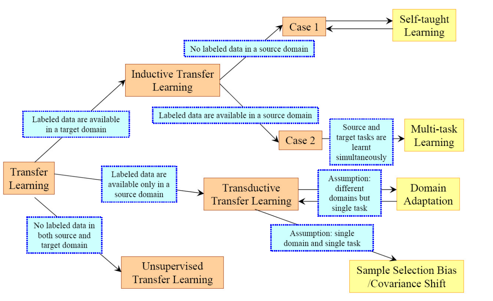

# transfer_learning

TL [34] uses past experience of a source task to improve learning (speed, data efficiency, accuracy) on a target 
task – by transferring a parameter prior, initial condition, or feature extractor [56] from the solution of a previous 
task. TL refers both to this endeavour to a problem area. In contemporary neural network context it often refers to a 
particular methodology of parameter transfer plus optional fine tuning (although there are nu- merous other approaches 
to this problem [34]). While TL can refer to a problem area, meta-learning refers to a methodology which can be used to 
improve TL as well as other problems. TL as a methodology is differentiated to meta-learning as the prior is extracted 
by vanilla learning on the source task without the use of a meta-objective. In meta-learning, the corresponding prior 
would be defined by an outer optimization that evaluates how well the prior performs when helping to learn a new task, 
as illustrated, e.g., by MAML [19]. More generally, meta-learning deals with a much wider range of meta-representations 
than solely model parameters (Section 4.1).
<!-- REFERENCE -->

[19] Model-Agnostic Meta-learning For Fast Adaptation Of Deep Networks

 
<!-- (model_agnostic_meta_learning_for_fast_adaptation_of_deep_networks.md) -->

# model_agnostic_meta_learning_for_fast_adaptation_of_deep_networks.md
## What?
- Model-agnostic meta-learning algorithm that can adapt to every gradient-based models, including classisication, 
regression, reinforcement leanring
## Why?
- To adapt to any gradient-based model
- Solve new task quickly with a few gradient steps by learning initial weights

## How?
The algorithm is shown in the images below:

- Loss function can be any frequenly used loss function for that task.
- MAML can maximize the sensitivity of the loss functions of new tasks with respect to the parameters.
## Results? (What did they find?)
- MAML can be used with any gradient-based models.
- MAML is sensitive to change in the task, such that small changes in the parameters will produce large improvements on 
the loss function.
- Perform better than transfer learning in regression tasks, because they can learn the abstract over tasks.
- State-of-the art in regression, classification, reinforcement learning 
- Without overfitting 
## Ideas to improve?
- Handle the computation problem. The paper currently use approximate method.

## Application ideas
- use meta-learning to find the initial weights for any deep learning model.
<!-- REFERENCE -->

[Model-Agnostic Meta-learning For Fast Adaptation Of Deep Networks](../papers/model_agnostic_meta_learning_for_fast_adaptation_of_deep_networks.md)

[34] A Survey On Transfer Learning

 
<!-- (a_survey_on_transfer_learning.md) -->

# a_survey_on_transfer_learning.md
## What?
- Categorizing and reviewing the progress on transfer learning
## Why?
- Survey
## How?

## Results? (What did they find?)

## Ideas to improve?
<!-- REFERENCE -->

[A Survey On Transfer Learning](../papers/a_survey_on_transfer_learning.md)

[56] How Transferable Are Features In Deep Neural Networks

 
<!-- (how_transferable_are_features_in_deep_neural_networks.md) -->

# how_transferable_are_features_in_deep_neural_networks.md

## What?
- Research about the transferability of layers in neural networks
- Find out the general and specific property of those layers.
- Transfer between similar and disimilar tasks
## Why?
- To find out the ways to transfer features more effectively
## How?
- Split to 2 tasks/datasets A and B randomly (ImageNet dataset)
- Evaluate the transferability of: (k is number of first layers transfered, + is retrain those layers)
    - Seffer network: BkB, BkB+
    - Transfer networks: AkB, AkB+
- Also evaluate on similar and disimilar tasks (compare based on the similar of images in dataset: human-made vs. natural)
## Results? (What did they find?)
- AkB+ is the most effective method.
- Transfer on similar task is more effective than disimilar ones
- Transfer from any pretrained features is better than transfer randomly
## Ideas to improve?
- This can be useful for meta-learning, when we learn many tasks, we can get the knowledge of other task and do 
few-shot learning
<!-- REFERENCE -->

[How Transferable Are Features In Deep Neural Networks](../papers/how_transferable_are_features_in_deep_neural_networks.md)

